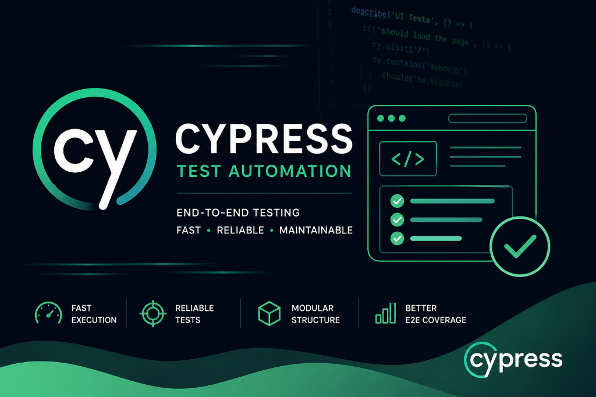

# 🥋 WebDojo — Laboratório de Automação de QA

> Um ambiente de prática full-stack projetado para construir e demonstrar habilidades em automação de testes de ponta a ponta (E2E) usando **Cypress**.

<p align="center">
  
</p>

---

## 📌 Sobre o Projeto

O WebDojo é uma aplicação web containerizada utilizada como laboratório pessoal de estudos para Automação de QA. O projeto cobre cenários do mundo real, incluindo **testes de interface (UI)**, **interceptação de chamadas de API (mocks)**, **drag-and-drop**, **interação com iFrames**, **eventos de hover** e **validação de formulários complexos**.

Este repositório representa um **portfólio prático de automação**, demonstrando proficiência em arquitetura de testes, comandos customizados, fixtures reutilizáveis e padrões de design de testes altamente manuteníveis.

---

## 🛠️ Stack Tecnológica

| Camada | Tecnologia |
|---|---|
| **Framework de Testes** | Cypress 14+ |
| **Eventos Avançados** | cypress-real-events |
| **Frontend (AUT)** | React + Vite (pré-compilado) |
| **Backend / Banco de Dados** | API em Node.js + PostgreSQL 13 |
| **Infraestrutura** | Docker & Docker Compose |
| **Admin de Banco de Dados** | pgAdmin 4 |
| **Ambiente de Execução** | Node.js 22+ |

---

## 📁 Estrutura do Projeto

```
webdojo/
├── cypress/                  # Suíte de testes Cypress (nível raiz)
│   ├── e2e/                  # Arquivos de especificações de teste (specs) E2E
│   │   ├── login.cy.js
│   │   ├── alerts.cy.js
│   │   ├── cep.cy.js
│   │   ├── consultancy.cy.js
│   │   ├── github.cy.js
│   │   ├── hover.cy.js
│   │   ├── iframe.cy.js
│   │   ├── kanban.cy.js
│   │   ├── links.cy.js
│   │   └── studio.cy.js
│   ├── fixtures/             # Dados estáticos para testes (JSON, PDF)
│   └── support/
│       ├── commands.js       # Comandos personalizados do Cypress
│       ├── e2e.js            # Configurações globais de inicialização
│       ├── utils.js          # Funções utilitárias auxiliares
│       └── actions/          # Abstrações de ações de página (Page Actions)
├── web/                      # Aplicação frontend
│   ├── dist/                 # Artefatos estáticos pré-compilados do React
│   └── package.json          # Script de inicialização do frontend
├── api/                      # API backend (Node.js)
├── cypress.config.js         # Arquivo de configuração do Cypress
├── package.json              # Raiz: scripts de execução de testes
├── docker-compose.yaml       # Orquestração da infraestrutura local
└── .gitignore
```

---

## ⚙️ Configuração do Ambiente

### Pré-requisitos

- [Docker Desktop](https://www.docker.com/products/docker-desktop/)
- [Node.js 22+](https://nodejs.org/)
- [npm](https://www.npmjs.com/) ou [yarn](https://yarnpkg.com/)

### 1. Iniciar a Infraestrutura

```bash
docker compose up -d
```

Isso inicializará:
- **PostgreSQL** na porta `5432`
- **pgAdmin** na porta `15432` → http://localhost:15432

### 2. Iniciar a Aplicação Web (Frontend)

```bash
cd web
npm install
npm run dev
```

A aplicação estará disponível em: **http://localhost:3000**

### 3. Instalar as Dependências do Cypress

A partir da **raiz do projeto**:

```bash
npm install
```

### 4. Configurar Variáveis de Ambiente (Opcional)

Crie um arquivo `cypress.env.json` na raiz do projeto (nunca comite este arquivo):

```json
{
  "BASE_URL": "http://localhost:3000",
  "DB_USER": "dba",
  "DB_PASSWORD": "dba",
  "DB_NAME": "UserDB"
}
```

---

## 🧪 Executando os Testes

Execute a partir da **raiz do projeto**:

```bash
# Abrir a interface interativa do Cypress Test Runner
npm run test:ui

# Executar todos os testes em modo headless (viewport desktop)
npm test

# Executar apenas o teste de login — desktop
npm run test:login

# Executar apenas o teste de login — viewport mobile
npm run test:login:mobile
```

---

## 🔒 Notas de Segurança

- As credenciais de banco de dados no `docker-compose.yaml` são **apenas para ambiente de desenvolvimento local**.
- Nunca comite o arquivo `cypress.env.json` ou qualquer outro arquivo que contenha credenciais reais.
- O `.gitignore` está configurado para excluir todos os arquivos sensíveis e subprodutos de execução do Cypress (vídeos, capturas de tela).

---

## 🏗️ Cenários de Teste Cobertos

| Spec | Cenários Testados |
|------|-------------------|
| `login.cy.js` | Fluxo de autenticação, validação de tokens em cookies e localStorage |
| `alerts.cy.js` | Interação com alertas JS, caixas de confirmação (confirm) e stubs de prompts |
| `cep.cy.js` | Interceptação de chamadas de API externas (ViaCEP) com mock de dados |
| `consultancy.cy.js` | Formulário complexo com uploads de arquivos, distinção PF/PJ e campos obrigatórios |
| `github.cy.js` | Operações de CRUD em tabelas, mapeamento e validações de links |
| `hover.cy.js` | Interações reais de movimento do mouse (hover) com auxílio da biblioteca `cypress-real-events` |
| `iframe.cy.js` | Interação e inserção de dados dentro de elementos aninhados em iFrames |
| `kanban.cy.js` | Operações de arraste e solte (drag and drop) de cards entre colunas |
| `links.cy.js` | Validação de links com o atributo `target="_blank"` e testes de navegação |
| `studio.cy.js` | Demonstração e exemplo prático de teste gerado via Cypress Studio |

---

*Projeto de estudo de Automação de QA pessoal — Desenvolvido para demonstrar habilidades avançadas de engenharia de testes.*
